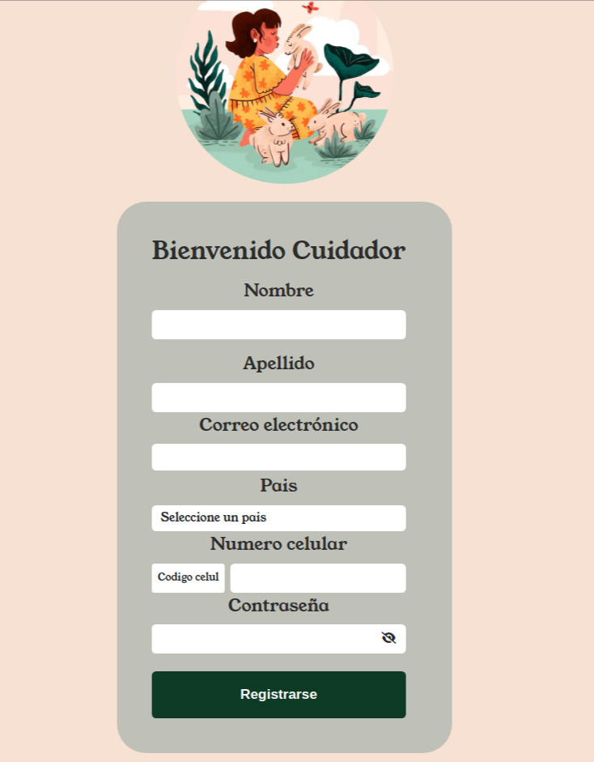
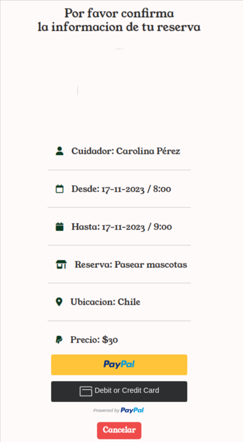
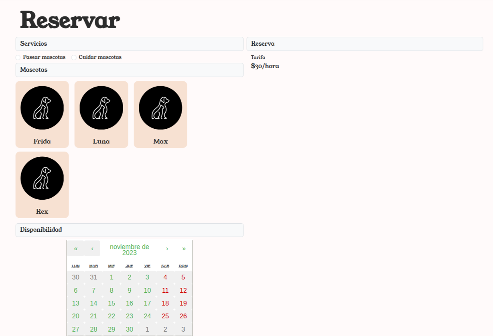

# Puppy Tail

"Puppy Tail" es una plataforma completa de cuidado de mascotas diseñada para simplificar la contratación de cuidadores de confianza. La aplicación garantiza una experiencia fluida y segura mediante la integración de tecnologías modernas y prácticas de desarrollo ágil.

## Características Principales

- **Registro y Perfiles de Usuarios:**

  - Personalización de perfiles para clientes, incluyendo detalles específicos sobre mascotas y preferencias.

- **Seguridad de Inicio de Sesión:**

  - Sistema seguro de inicio y cierre de sesión para proteger la privacidad de los usuarios.

- **Contratación de Cuidadores:**

  - Interfaz intuitiva para explorar perfiles, calificaciones y comentarios de cuidadores.

- **Proceso de Pago Eficiente:**

  - Integración de PayPal para transacciones seguras y rápidas.

- **Historial de Transacciones:**
  - Seguimiento transparente de pagos y servicios contratados.

## Tecnologías Utilizadas

### Backend

- Flask (Python), SQL Alchemy para el manejo de la base de datos.

### Frontend

- React, Bootstrap, HTML, CSS.

### Otras Tecnologías

- Integración de PayPal para pagos seguros.

## Instrucciones de Instalación:

#### Backend:

- Instala los paquetes de Python: `$ pipenv install`
- Crea un archivo .env basado en .env.example: `$ cp .env.example .env`
- Instala tu motor de base de datos y crea tu base de datos. Define la variable DATABASE_URL en el - archivo `.env ` con los detalles de tu base de datos.
- Ejecuta migraciones: `$ pipenv run migrate` (omitir si no hay cambios en models.py)
- Actualiza la base de datos:`$ pipenv run upgrade`
- Inicia la aplicación: `$ pipenv run start`

#### Front-End:

> Asegúrate de usar Node versión 14+ y haber instalado y ejecutado el backend con éxito.

- Instala los paquetes:` $ npm install`
- Inicia el servidor de desarrollo de webpack:` $ npm run start`

## Algunas imagenes de lo que es Puppy Tail

